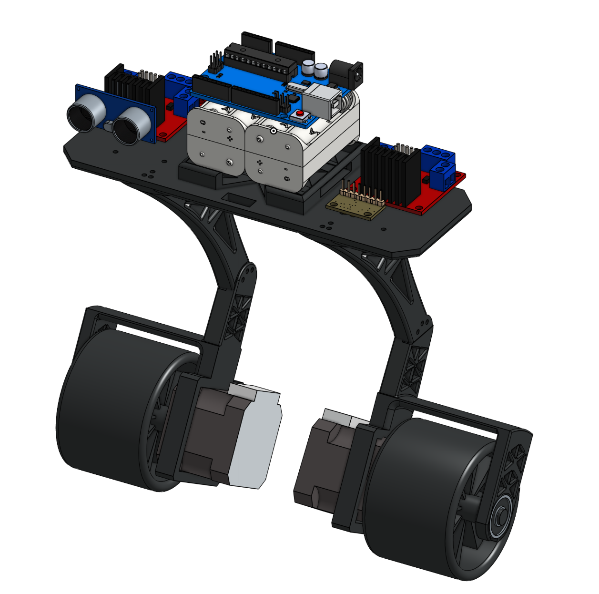
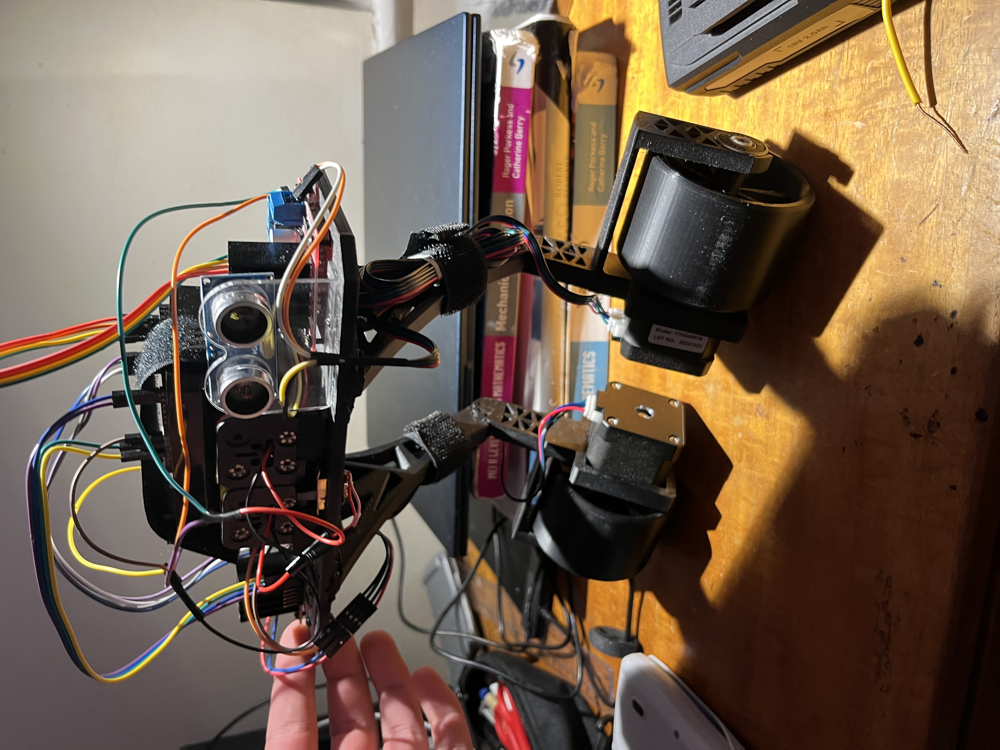

# Self-Balancing Robot (PID Controlled)

A two-wheeled self-balancing robot using stepper motors, an IMU, and a PID control system.

## CAD Model

## Final Build

## Links
[Onshape CAD](https://cad.onshape.com/documents/77841446f1b41ab34413a012/w/3976edb733c54040d0cf4a11/e/2c77be59104294cb53648c13?renderMode=0&uiState=69f358ae310ae950be3c7d36)

[Google Slides](https://docs.google.com/presentation/d/11a6YWDmIo3_uVGVUQJ4fRdrg8UfdcLoaTxgzl_Zd4M4/edit?usp=sharing)

### All rough workings documented on google slides

## Overview
This project investigates real-time control systems by building a Segway-style robot that balances using a PID feedback loop. The aim of this project was to gain familiarity with PID controllers and the manufacturing processes needed to create a final working device.

## Key Features
- PID control

- Complementary filter (IMU fusion)

- Stepper motor drive
- Custom 3D printed chassis
- Kill switch

## Repository Structure
- docs/ (theory + design)
- hardware/ (CAD + electronics)
- software/ (Arduino + PC code)
- experiments/ (tuning + logs)

## Status
Work in progress, There is movement, PID controller needs tuning and motor drivers need replacing.

## Current Reflections and Next Steps
Overall the project has acheived its aims. The design and build processes were very successful due to manufacturing considerations taken in CAD allowing for components to be mounted on easily. Additionally, the programming stage has deppened my understanding of PID controllers which was the main goal.

The project had some challenges which act as a learning opportunity for future robotics projects. namely, the heated inserts were too small so plastic welding was used, low quality motor drivers caused jittering so adopting microstepping to smooth motion, and the power source having a low current limit and causing motors to stall, this was fixed by repurposing an 18V electric strimmer battery, 3D printing a press-fit mount and wiring a fixed resistor to work safely with the BMS (battery management system). With some more fixes to the circuitry the project would be fully complete. Main goals have still been acheived and funding has been redirected to other projects at the moment, planning to revisit this soon.

Future updates will include, ultrasound sensor implemetation for obstacle detection and HC-05 blutooth module transmission between a laptop and the arduino to offload the computing power and allow for more software features.
