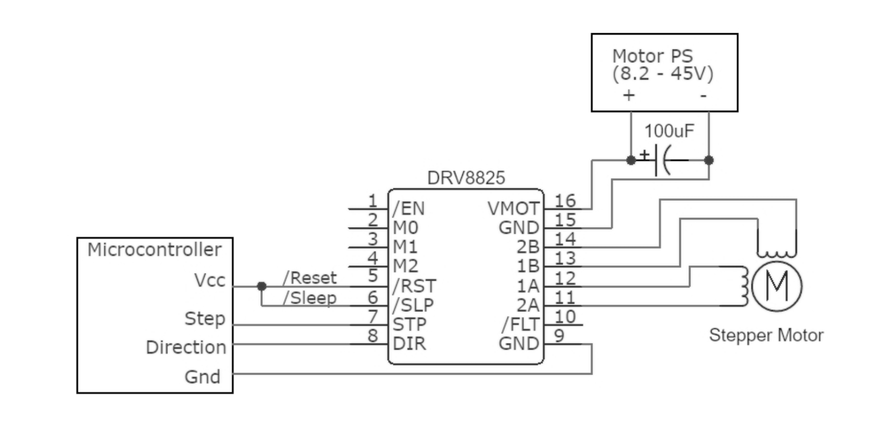

# Electronics

## Circuit for individual Motor

## Components
- Arduino Uno
- MPU6050 IMU (6 DOF)
- NEMA 17 stepper motors
- DRV8825 motor drivers
- NMGT18-Li_48 2.0Ah 18V rechargable battery pack

## Problems
- Insufficient current supply
- Driver overheating
